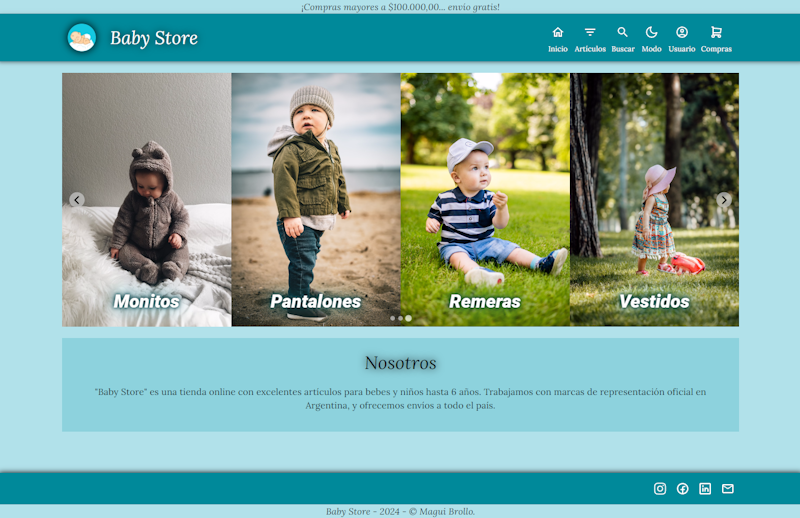

<!-- ===========================================================
                            PRESENTACIÓN
     =========================================================== -->

   

---

---

## Tabla de Contenidos:

- [Baby Store](#baby-store)
- [Tecnologías](#tecnologías)
- [Menús](#menús)
- [Mobile](#mobile)
- [Contáctame](#contáctame)

---

 
<!-- ==================================================
                         CONTENIDO 
     ================================================== -->

## _Baby Store_

[:top:](#tabla-de-contenidos)  

Las aplicaciones web, comúnmente conocidas como apps, se han convertido en una parte esencial de nuestra vida cotidiana. Las apps se han consolidado como nuestras aliadas, simplificándonos tareas diarias complejas como otras no tan complejas como por ejemplo, comprar artículos o servicios. 

  

> `Baby Store` es una tienda en línea de ropa para niños de cero a seis años.

 

   

 

> [!NOTE]
> La aplicación `Baby Store`, fue diseñada de tal manera que puede ser utilizada en diferentes dispositivos, lo que implica un correcto diseño responsive.

 

Baby Store es una app desarrollada como Trabajo Final de la capacitación de `"Desarrollo Frontend"` dictada por [ADA ITW](https://www.linkedin.com/school/ada-itw/), y se encuentra incluida en mi `Portfolio Personal`, de tal manera de reflejar el grado de avance, apropiación y uso de los conocimiento adquiridos y asimilados durante la capacitación.

> [!NOTE]
> Visite mi portafolio personal: [PORTFOLIO](https://maguibrollo.github.io/ADA_Portafolio_mod01_tf/).

 

## _Tecnologías_

[:top:](#tabla-de-contenidos)  
`Baby Store` fue desarrollada utilizando las siguientes tecnologías:

|                                                     |                                                                                                   |
| :---------------------------------------------------------------------------------------------------------------------------------------------------------------------------: | :-----------------------------------------------------------------------------------------------------------------------------------------------------------------------------------------------------------------------------------: |
| React es una biblioteca Javascript de código abierto diseñada para crear interfaces de usuario con el objetivo de facilitar el desarrollo de aplicaciones en una sola página. | Material UI es una librería de componentes de React. js, de código abierto creada por Google, basada en Material Design, la cual brinda pautas y lineamientos que sientan la base para crear diseños profesionales para aplicaciones. |

 

## _Menús_

[:top:](#tabla-de-contenidos)  

La aplicación cuenta con los siguientes menús: [Inicio](#inicio), [Artículos](#artículos), [Buscar](#buscar), [Modo](#modo), [Usuario](#usuario), [Compras](#compras).

 

   

 

---

### _Inicio:_

[:top:](#menús)  

Al iniciar la aplicación se visualiza un carrusel de imágenes alusivas, e información básica de Baby Store.

 

   

---

### _Artículos:_

[:top:](#menús)  

El menú Artículos es el corazón de la aplicación ya que permite ver todos los artículos ordenados por nombre, pero también permite filtrar por categoría.
Como se puede observar en la imagen, las categorías aparecen ordenadas alfabéticamente acompañadas con un número que indica la cantidad de artículos que tiene cada categoría. Las categorías que no tienen artículos se encuentran deshabilitadas.

   

 

Luego de seleccionar "Todos" o una "Categoría", se puede ver un mensaje que informa lo seleccionado, y el número de página.

   

> [!NOTE]
> Cuando la cantidad de artículos mostrados supera la cantidad de 8 (ocho), se habilita automáticamente la paginación.

   

Todos los artículos tiene un botón que permite `Ver Mas - Comprar`

   

Al presionar ese botón, se abre una ventana con más información del artículo.  
Esa ventana se puede mover por la pantalla para poder ver los demás artículos. 

   

Se puede seleccionar la cantidad de artículos a comprar respetando no más de 5 artículos, y respetando el Stock disponible, en caso de no cumplir con una de las condiciones se mostrará un mensaje de advertencia. 
 
Si se cumple con las condiciones se puede realizar la compra del artículo presionando el botón `Comprar`. Luego de presionar el botón "comprar" se visualiza un pequeño cartel informando que el artículo fue agregado al Carrito de Compras.

   

> [!NOTE]
> Para poder realizar una compra se debe iniciar sesión (o crear una cuenta).

   

---

### _Buscar:_

[:top:](#menús)  

Buscar permite escribir una palabra por ejemplo "remera", y busca entre los datos de cada artículo, sin tener en cuenta la categoría.
La información encontrada se visualiza de la misma manera que cuando se filtra por artículos. Al igual que en artículos, también es posible realizar la compra (si ha iniciado sesión).

   

---

## _Modo_

[:top:](#menús)  

Toda la aplicación se puede visualizar en modo claro o bien en modo oscuro.

|                    Modo Claro                    |                   Modo Oscuro                    |
| :----------------------------------------------: | :----------------------------------------------: |
|  |  |

 

---

### _Usuario:_

[:top:](#menús)  

Al seleccionar este menú se puede `Iniciar SESIÓN` si ya tiene cuenta, o bien `Crear CUENTA`.

   

|                    Iniciar Sesión                    |                   Crear Cuenta                    |
| :----------------------------------------------: | :----------------------------------------------: |
|  |  |

Si se inició sesión, este menú cambia y presenta las opciones de `Mis Compras`, y `Cerrar sesión`. Además, de ver el carrito de compras, si tiene.
 

   

|                    Mis compras                    |                   Cerrar Sesión                    |
| :----------------------------------------------: | :----------------------------------------------: |
|  |  |

---

### _Compras:_

[:top:](#menús)  

Este menú está disponible únicamente para los usuarios que han iniciado sesión. 
  Si el carrito tiene artículos se puede visualizar la cantidad de artículos mediante un número con fondo rojo. Si el carrito no tiene artículos no hay número, pero igual se puede acceder.

   

El carrito de compras presenta la siguiente información: 
 - Fecha y hora en que se creó el carrito.
 - Duración: los carritos serán borrados después de un día.
 - Datos del producto comprado.
 - Total de la compra.
 

Además, los botones `FINALIZAR COMPRA` y `ELIMINAR CARRITO`

   

 

Si selecciona `FINALIZAR COMPRA` se pasará a página de checkout.
 

- Paso 1: Controlar Artículos, Cantidad, Precio y Total.
- Paso 2: Completar datos de envio.

|                    Paso 1                    |                   Paso 2                  |
| :----------------------------------------------: | :----------------------------------------------: |
|  |  |

- Paso 3: Aceptar todos los datos.
- Finalizar: Comprar finalizada. Muchas Gracias.

|                    Paso 3                    |                   Finalizar               |
| :----------------------------------------------: | :----------------------------------------------: |
|  |  |

> Se debe `MARCAR` cada paso para poder finalizar la compra.

---

> [!NOTE]
> Cuando se intente acceder a una página inexistente se mostrara el `ERROR 404`.

   

---

## _Mobile:_

[:top:](#tabla-de-contenidos)  

Todas las opciones antes mencionadas se encuentran disponibles para los diferentes tamaños de móviles.

   

---

## _Contáctame:_

[:top:](#tabla-de-contenidos)  

---

