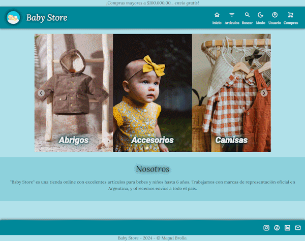

<!-- ===========================================================
                            PRESENTACIÓN
     =========================================================== -->

   

---

---

## Tabla de Contenidos:

- [Baby Store](#baby-store)
- [Tecnologías](#tecnologías)
- [Menús](#menús)
- [Mobile](#mobile)
- [Contáctame](#contáctame)

---

 
<!-- ==================================================
                         CONTENIDO 
     ================================================== -->

## _Baby Store_

[:top:](#tabla-de-contenidos)  

> Las aplicaciones web, comúnmente conocidas como apps, se han convertido en una parte esencial de nuestra vida cotidiana. Las apps se han consolidado como nuestras aliadas, simplificándonos tareas diarias complejas, como otras no tan complejas como, por ejemplo la búsqueda de empleo.   `Baby Store` es un ecomerce de ropa para niños de cero hasta seis años.

   

La aplicación `Baby Store`, fue diseñada de tal manera que puede ser utilizada en diferentes dispositivos, lo que implica un correcto diseño responsive.

   

 

Baby Store es una app desarrollada como Trabajo Final de la capacitación de `"Desarrollo Frontend"` dictado por [ADA ITW](https://www.linkedin.com/school/ada-itw/), y se encuentra incluido en mi `Portfolio Personal`, de tal manera de reflejar el grado de avance, apropiación y uso de los conocimiento adquiridos y asimilados durante la capacitación.

> [!NOTE]
> Visite mi portafolio personal: [PORTFOLIO](https://maguibrollo.github.io/ADA_Portafolio_mod01_tf/).

 

## _Tecnologías_

[:top:](#tabla-de-contenidos)  
Teacher JOB fue desarrollada utilizando las siguientes tecnologías:

|                                                     |                                                                                                   |
| :---------------------------------------------------------------------------------------------------------------------------------------------------------------------------: | :-----------------------------------------------------------------------------------------------------------------------------------------------------------------------------------------------------------------------------------: |
| React es una biblioteca Javascript de código abierto diseñada para crear interfaces de usuario con el objetivo de facilitar el desarrollo de aplicaciones en una sola página. | Material UI es una librería de componentes de React. js, de código abierto creada por Google, basada en Material Design, la cual brinda pautas y lineamientos que sientan la base para crear diseños profesionales para aplicaciones. |

 

## _Menús_

[:top:](#tabla-de-contenidos)  

La aplicación cuenta con los siguientes menús: [Inicio](#inicio), [Artículos](#artículos), [Buscar](#buscar), [Modo](#modo), [Usuario](#usuario), [Compras](#compras).

 

   

---

### _Inicio:_

[:top:](#menús)  
Al iniciar la aplicación se visualiza un carrusel de imágenes alusivas, en información básica de nosotros.

 

   

---

### _Artículos:_

[:top:](#menús)  
Este menú es el corazón de la aplicación, ya que presenta todas las

   

 

> [!NOTE]
> Cuando la información visualizada -listado, ver más, editar, inscripción- habilite el scroll vertical se puede visualizar la aparición de una flecha que le permitirá volver al menú de manera más práctica.

---

### _Buscar:_

[:top:](#menús)  

Por medio de

---

## _Modo_

[:top:](#tabla-de-contenidos)  
Todas las opciones antes descriptas, se encuentran disposnibles para los diferentes dispositivos móviles.

|                    Modo Claro                    |                   Modo Oscuro                    |
| :----------------------------------------------: | :----------------------------------------------: |
|  |  |

 

---

### _Usuario:_

[:top:](#menús)  
Al iniciar la aplicación, se visualiza un mensaje de bienvenida con un carrusel de imágenes alusivas.

 

   

---

### _Compras:_

[:top:](#menús)  
Este menú es el corazón de la aplicación, ya que presenta todas las

   

 

> [!NOTE]
> Cuando la información visualizada -listado, ver más, editar, inscripción- habilite el scroll vertical se puede visualizar la aparición de una flecha que le permitirá volver al menú de manera más práctica.

---

## _Contáctame:_

[:top:](#tabla-de-contenidos)  

---

